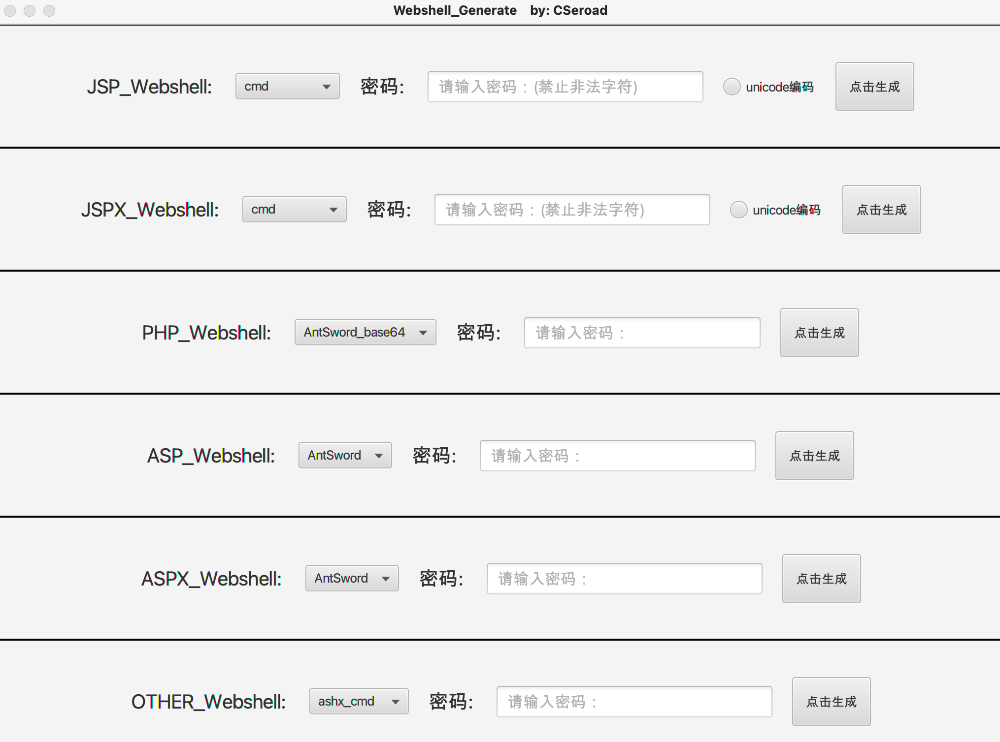

## Webshell_Generate
**仅用于技术交流，请勿用于非法用途。**

该工具没什么技术含量，学了一点javafx，开发出了几个简单功能用来管理webshell。
工具整合并改进了各类webshell，支持cmd、蚁剑、冰蝎，又添加了实际中应用到的一些免杀技巧，以方便实际需要。

## 使用说明
可以下载release版本

也可以maven打包
```
mvn package 
```




## 参考资料

参考了诸多大佬的文章和工具，如

https://github.com/CrackerCat/JSPHorse

https://github.com/LandGrey/webshell-detect-bypass

https://github.com/czz1233/GBByPass

https://github.com/pureqh/Troy

http://yzddmr6.com/posts/jsp-webshell-upload-bypass/

